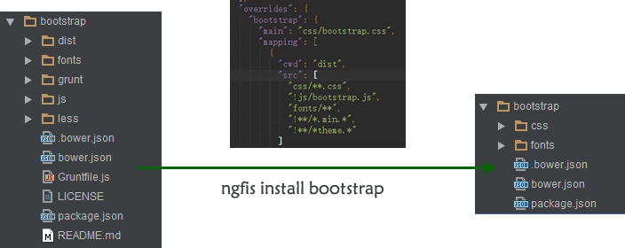

`ngfis`的`bower`生态模块安装插件
=====================
[](https://www.npmjs.org/package/ngfis-command-install)

### 为何不直接用`bower`？
  当前社区的模块质量良莠不齐，很多类库都不符合[`bower.json-spec`](https://github.com/bower/bower.json-spec),的规范，仓库里面经常有很多源码垃圾文件，甚至很多模块安装之后不可用或者根本安装不上。

@fouber 也曾多次提到「模块生态及版本管理是一个细思恐极的问题」， 所以[`scrat`](http://scrat-team.github.io/#!/components)选择的方案是**「自建高质量的小范围生态」**。
对于社区的模块， 采用`travis`同步方式， 参见[transform.js]( https://github.com/scrat-team/font-awesome/blob/master/.scrat/transform.js)。

不过作为`angular`的拥护者， 丢弃`bower`总是觉得可惜， 同时发现`angular`的周边模块质量相对好一点。

于是经过多次的反复纠结，于是编写了该组件，可以较完美的满足我的需求。

### 安装说明
需配置`fis`使用，可以参见`ngfis`项目。

`npm install ngfis-command-install --save`

### 使用说明
- `ngfis install`
- `ngfis install bootstrap zepto`
- `ngfis install angular-mocks --save-dev`

**支持的参数：**

参数 | 描述
------------ | -------------
-d, --directory [path] | 类库安装目录， 默认为`component_modules`，<br/>`fis-conf`配置项:`settings.command.install.directory`
-c, --clean | 清除`bower`的cache缓存
--dev | 安装devDependencies开发模块
--no-save | 不保存到`bower.json` (跟`bower`不同，默认会保存)
--save-dev | 保存到`bower.json`的`devDependencies`属性

### 原理说明
- 调用[`bower programmatic api`](http://bower.io/docs/api/#programmatic-api)安装依赖
- 根据`mapping`配置，使用[glob规则](https://github.com/isaacs/node-glob)来清洗目录文件
- 对应的修改或覆盖模块`bower.json`的属性


### 配置说明

对项目的`bower.json`增加以下属性的支持：

属性 | 类型 | 描述
------------ | ------------- | -------------
ignoreDependencies | Array | 忽略的依赖，如需要去掉`bootstrap`默认依赖的`jquery`
overrides | Object | key为类库名称， value为配置项， 包括`mapping`, `main`, `exports`等
- overrides.mapping | Array | 支持`字符串`和[`grunt.file的glob配置格式`](http://gruntjs.com/configuring-tasks#globbing-patterns)
- overrides.main | Array/String | 覆盖原`main`属性，如`bootstrap`只需要第一个`css`
- overrides.componentMain | String | 当`main`为数组的时候，需指定一个文件为主文件(release分析别名时用)
- overrides.exports | String | `ngfis`自动包裹`define`时用到

配置的优先级： `项目bower.json配置` > `插件内置bower-meta.js` > `模块本身的bower.json配置`

### 示例
```
{
  "name": "ngfis-showcase",
  "private": true,
  "dependencies": {
    "angular": "~1.3.7",
    "angular-touch": "~1.3.7",
    "bootstrap": "~3.3.1",
    "zepto": "~1.1.6",
    "ui-router": "~0.2.13",
    "angular-resource": "~1.3.8",
    "angular-route": "~1.3.8",
    "angular-bootstrap": "~0.12.0"
  },
  "devDependencies": {
    "angular-mocks": "~1.3.7"
  },
  "ignoreDependencies": [
    "jquery"
  ],
  "overrides": {
    "bootstrap": {
      "main": "css/bootstrap.css",
      "mapping": [{
        "cwd": "dist",
        "src": [
        "css/**.css",
        "!js/bootstrap.js",
        "fonts/**",
        "!**/*.min.*",
        "!**/*theme.*"
        ]
      }]
    }
  },
  "resolutions": {
    "angular": "1.3.8"
  }
}

```
**运行效果：**

